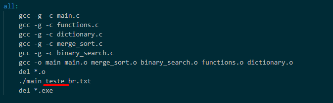

# Anagram-searcher

Data structure 2 project. This program takes a word inputed by the user in the command line and looks up on the local dictionary for anagrams. 

## How to run ?

By using the makefile, just type `make` on your terminal inside the src folder. To change the word, just go inside the makefile and change the word next to `./main`.

